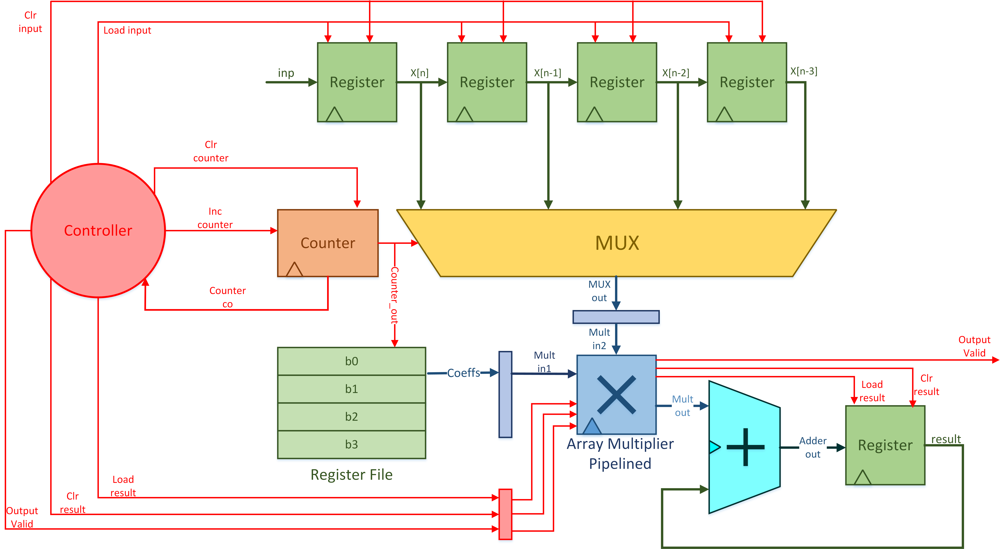
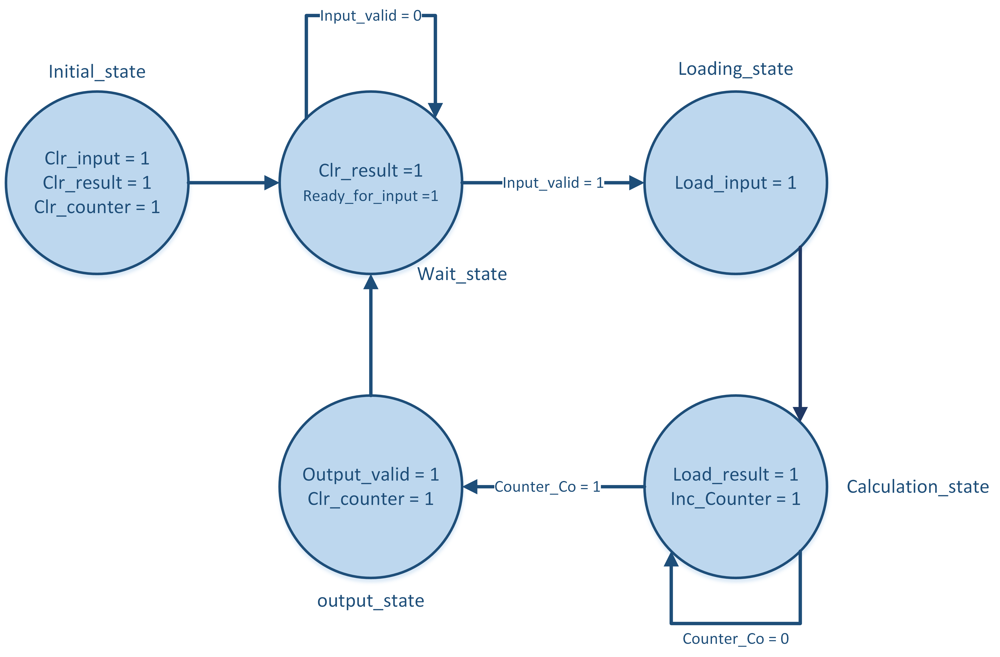

# FIR Filter Design with Configurable Pipelined Multiplier

## Overview

This project presents the design and implementation of a Finite Impulse Response (FIR) filter in Verilog, incorporating a unique configurable pipelined multiplier with a critical path of one. The FIR filter is specifically crafted to achieve high efficiency and accuracy, benefiting from optimized pipeline stages that reduce computation delays significantly. The project also includes detailed documentation and illustrations, providing an in-depth explanation of the design flow, architecture, and testing methodology.

## Key Features

- **Configurable Pipelined Multiplier**: Designed to handle high-frequency data processing with a critical path of one, making it optimal for FPGA implementations. This multiplier is highly configurable, enabling its use across different FIR filter lengths and data widths.
- **Illustrated Design Flow**: Comprehensive drawings and flow diagrams to aid in understanding the FIR filter’s structure and operation, from input handling to output validation.
- **Detailed Controller and Data Path**: A well-defined controller and data path structure enable precise handling of input signals, coefficient loading, and output generation.

## Project Structure

- **Illustrations**: Contains visuals that explain each stage of the design, including the data flow, multiplier pipeline stages, and controller state machine.
- **Source Code**: Verilog files for the FIR filter, configurable pipelined multiplier, and control logic.
- **Documentation**: Detailed design report explaining the FIR filter architecture, multiplier configuration, controller logic, and testing strategies.

## FIR Filter Architecture

The FIR filter follows a modular design, with separate modules for the data path and control logic:

1. **Data Path**: The data path utilizes a pipelined array multiplier designed to minimize the critical path. The array multiplier was implemented using a four-bit structure with seven full-adder stages, effectively balancing computation speed with resource efficiency.

2. **Control Logic**: The control unit manages signal timing and directs the data path. It ensures that input data, filter coefficients, and intermediate results flow through the multiplier pipeline correctly. The controller also synchronizes the output validation signal to indicate valid data output, allowing continuous input processing without delay.

## Configurable Pipelined Multiplier

The multiplier’s design is integral to achieving the low-latency performance required for real-time FIR filtering. Key features include:

- **Pipeline Stages**: Each stage is carefully designed to reduce the longest combinational path, resulting in a critical path of one. This design choice significantly enhances the FIR filter’s maximum operating frequency.
- **Signed Number Compatibility**: The multiplier includes handling for signed numbers by incorporating sign extension techniques. This ensures accurate multiplication across a range of input values without additional computation overhead.

## Implementation Flow

The following steps summarize the implementation flow, with references to corresponding illustrations:

1. **Initialization**: All registers are reset to zero, preparing the FIR filter for data processing.
2. **Input Handling**: Incoming data samples are loaded into the pipeline, shifting older samples as new ones enter.
3. **Coefficient Application**: Filter coefficients are loaded and applied in the multiplier stages, accumulating the results to compute the FIR output.
4. **Output Validation**: The controller generates an output validation signal once the filter completes processing the current data sample.

The accompanying illustrations provide step-by-step views of these stages, offering a clear visualization of how the FIR filter operates in real-time.

## Testing and Validation

A comprehensive testbench verifies the FIR filter’s functionality. The testbench simulates the FIR filter with varying input data and coefficients, comparing outputs against expected results to ensure accuracy. Assertions and validation flags confirm the integrity of the filter design, with waveforms illustrating data progression through the pipeline.

## Synthesis and Performance

The filter is synthesized on FPGA, specifically targeting Cyclone II devices. Resource utilization and maximum operating frequency metrics are recorded across various configurations of data width and filter length. The configurable multiplier, with its critical path of one, allows the design to achieve high clock frequencies with minimal logic resources.

| Filter Length | Data Width | Total Logic Elements | Max Frequency |
|---------------|------------|----------------------|---------------|
| 50            | 8          | 1383                | 233 MHz      |
| 50            | 16         | 4041                | 168 MHz      |
| 100           | 8          | 2022                | 185 MHz      |
| 100           | 16         | 5386                | 171 MHz      |

## Getting Started

To run this FIR filter on your FPGA:
1. Clone the repository.
2. Open the project in your preferred FPGA development environment (Quartus, ModelSim, etc.).
3. Compile the Verilog files.
4. Load the design onto the FPGA and start the testbench for verification.

## Files in the Repository

- **`src/`**: Contains Verilog source files for the FIR filter, multiplier, and control modules.
- **`docs/`**: Includes the detailed project report and design illustrations.
- **`test/`**: Contains the testbench files and input/output data for validation.

## Future Improvements

Potential future improvements include:
- Extending the multiplier for higher precision applications.
- Integrating support for variable filter coefficients for real-time tuning.
- Enhancing the control logic for additional input/output handling flexibility.
